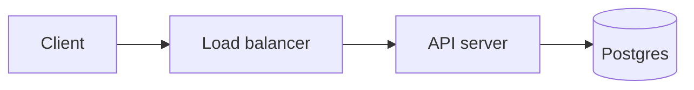

# PeliTech Engineering Atlas

An open-source engineering knowledge base covering **system design, software architecture, backend
engineering, databases, APIs and third-party integrations**.

Most material on these topics either stops at definitions or jumps straight to interview answers. This
sits in between. Each article explains the problem a technique exists to solve, how it actually works,
what it costs, and how it fails — with architecture and sequence diagrams, worked code, explicit
trade-offs, failure scenarios, and security and scalability considerations.

Everything is MDX in this repository, so a correction is a pull request.

## Contents

- [What is here](#what-is-here)
- [Local setup](#local-setup)
- [How content works](#how-content-works)
- [Writing an article](#writing-an-article)
- [Project structure](#project-structure)
- [Architecture](#architecture)
- [Scripts](#scripts)
- [Deployment](#deployment)
- [Contributing](#contributing)

## What is here

| Area                      | Covers                                                                       |
| ------------------------- | ---------------------------------------------------------------------------- |
| **System Design**         | Fundamentals, architecture, scalability, reliability, distributed systems    |
| **Backend**               | API design, authentication, authorization, background jobs, queues, realtime |
| **Databases**             | SQL, NoSQL, indexing, transactions, normalization, replication               |
| **Integrations**          | Payments, identity providers, notifications, storage, webhooks               |
| **Software Engineering**  | Principles, patterns, clean code, testing, debugging, code quality           |
| **DevOps**                | Docker, CI/CD, deployment, monitoring, infrastructure                        |
| **How Things Work**       | End-to-end walkthroughs of complete technical flows                          |
| **Engineering Decisions** | Head-to-head technology and architecture comparisons                         |
| **Case Studies**          | Full system design walkthroughs with capacity estimates and failure analysis |

The taxonomy is deliberately complete while the content is not — the empty sections are the roadmap, and
each one renders a listing page inviting contributions.

## Local setup

Requires **Node 22.12 or newer** (the version in [`.nvmrc`](.nvmrc)).

```bash
git clone https://github.com/DarkeyPeleg/PeliTech-Engineering-Atlas.git
cd PeliTech-Engineering-Atlas

nvm use          # or install Node 22 another way
npm install
npm run dev      # http://localhost:3000
```

That is the whole setup. There is no database, no CMS, no API keys and no external service — the site is
statically generated from the `docs/` directory.

Two notes for local work: articles with `draft: true` are visible in development and excluded from
production builds, and the search index is regenerated automatically by `predev` and `prebuild`.

## How content works

**A file's path is its URL.** There is no route configuration and no registry to update.

```text
docs/system-design/scalability/load-balancing.mdx   ->  /system-design/scalability/load-balancing
docs/databases/index.mdx                            ->  /databases
docs/case-studies/payment-system/02-capacity.mdx    ->  /case-studies/payment-system/capacity
```

A numeric prefix (`02-`) sets ordering and is stripped from the URL. A directory's `index.mdx` becomes
the directory's own page; a directory without one still gets a page listing its contents.

**Navigation is generated.** The sidebar, breadcrumbs, previous/next links, section listings, homepage
cards, search index and sitemap are all derived from the file tree. Adding an article to the navigation
requires no code change.

**`_meta.json` names each directory.** Optional, per directory:

```json
{
  "label": "Scalability",
  "description": "Handling more load without proportionally more pain.",
  "order": 3,
  "items": ["load-balancing", "horizontal-vs-vertical-scaling"],
  "collapsed": false
}
```

Anything not listed in `items` is appended alphabetically, so the file is a way to promote what matters
rather than a list you must keep exhaustive.

## Writing an article

Generate the file, then write it:

```bash
npm run new:article -- --path databases/indexing/composite-indexes --title "Composite Indexes"
npm run new:article -- --path case-studies/ecommerce/design --template case-study
```

Templates live in [`docs/_templates/`](docs/_templates/): `concept`, `case-study` and `comparison`.

### Frontmatter

```yaml
---
title: 'What Is a Load Balancer?' # required — h1, page title, primary search field
description: 'Why load balancers exist…' # required — meta description and search summary
category: 'System Design' # optional — defaults to the section label
tags: [load-balancing, scalability] # optional — search and related-content signal
difficulty: 'Beginner' # optional — Beginner | Intermediate | Advanced
lastUpdated: '2026-09-14' # optional — ISO date, used in the sitemap
readingTime: 12 # optional — overrides the computed estimate
relatedTopics: # optional — validated, so typos fail CI
  - system-design/scalability/horizontal-vs-vertical-scaling
draft: false # optional — hidden from production
order: 1 # optional — sidebar position
toc: true # optional — render the table of contents
---
```

`relatedTopics` accepts a full slug or just the final segment when it is unambiguous. Both are checked by
`npm run validate`, so a rename cannot silently leave a dangling link.

### Components available in MDX

No imports needed — these are registered globally in
[`src/mdx-components.tsx`](src/mdx-components.tsx).

| Component                                                                           | Purpose                                              |
| ----------------------------------------------------------------------------------- | ---------------------------------------------------- |
| `<Steps>` / `<Step>`                                                                | Numbered walkthroughs                                |
| `<TradeOffs>`                                                                       | Side-by-side strengths and weaknesses                |
| `<ComparisonTable>`                                                                 | Structured comparison for decision articles          |
| `<FailureScenarios>`                                                                | Failure, impact and mitigation table                 |
| `<Requirements>`                                                                    | Functional and non-functional requirements           |
| `<CapacityEstimate>`                                                                | Back-of-the-envelope numbers, with the working shown |
| `<KeyTakeaways>`                                                                    | The points a reader should leave with                |
| `<Diagram>`                                                                         | Figure and caption wrapper for non-Mermaid visuals   |
| `<Note>` `<Tip>` `<Warning>` `<SecurityNote>` `<ScalabilityNote>` `<CommonMistake>` | Asides                                               |

### Diagrams

Write a fenced code block. It becomes a rendered, lazily-loaded diagram:

````markdown

````

Apply the semantic classes — `service`, `datastore`, `queue`, `cache`, `external`, `highlight` — rather
than writing colours. Mermaid loads only when a diagram scrolls into view, so pages without diagrams
ship no diagramming code.

### Code blocks

Highlighting happens at build time, so no highlighter reaches the browser. Add a filename with
`title=""` and highlight lines with `{1,3-5}`:

````markdown
```typescript title="server.ts" {2}
export function handler(request: Request): Response {
  return new Response('ok');
}
```
````

Supported languages are listed in [`src/lib/content/shiki.ts`](src/lib/content/shiki.ts) and include
TypeScript, JavaScript, Python, Java, C++, SQL, Bash, JSON, YAML, Dart and **AL** — the last via a
grammar written for this project, since Shiki does not bundle one. An unrecognised language degrades to
plain text rather than failing the build.

## Project structure

```text
docs/                        All content. Path = URL.
  _templates/                Article templates (not routed)
  <section>/_meta.json       Directory label, description and ordering
design.md                    The styling contract
src/
  app/
    [...slug]/page.tsx       Every documentation route
    theme.css                Design tokens — the only place colours are defined
    globals.css              Base styles and the article-prose layer
    styleguide/              Live token and component reference
  components/
    docs/                    TOC, breadcrumbs, metadata, prev/next, listings
    mdx/                     Components authors use in articles
    nav/                     Header, sidebar, footer
    search/                  Search dialog
    ui/                      Button, Badge, Card
    decor/                   Confetti framing (decorative only)
  lib/
    content/                 The content layer: schema, walker, tree, MDX pipeline
    search/                  Index builder and client
    config/site.ts           Product name, tagline and URLs
scripts/                     Search index, validation, pipeline check, generator
```

## Architecture

**Static generation.** Every page is prerendered at build time by `generateStaticParams()` over the
content index. There is no server-side rendering at request time and no runtime data source, so the
output is a static site that any CDN can serve.

**One content layer.** [`src/lib/content/source.ts`](src/lib/content/source.ts) walks `docs/` once,
validates frontmatter with Zod, and produces the index that routing, navigation, search, related links,
the sitemap and page metadata all read from. Nothing about an article is declared in application code.

**MDX compiled in the route.** [`src/lib/content/mdx.ts`](src/lib/content/mdx.ts) is the only place
remark, rehype and Shiki are configured, so how content becomes HTML is a single file's concern.

**Client-side search.** A JSON index is generated at build time and queried in the browser with
MiniSearch, fetched on first use. No search service, and the site stays statically hostable.

**Design tokens compile-enforced.** [`design.md`](design.md) is encoded in
[`src/app/theme.css`](src/app/theme.css), which also clears Tailwind's default palette and scales — so
`text-red-500` and `rounded-md` do not exist, and a hardcoded colour in a component fails CI.

## Scripts

| Command                  | What it does                                               |
| ------------------------ | ---------------------------------------------------------- |
| `npm run dev`            | Development server, with the search index rebuilt first    |
| `npm run build`          | Production build; fully static output                      |
| `npm run typecheck`      | TypeScript, no emit                                        |
| `npm run lint`           | ESLint                                                     |
| `npm run validate`       | Frontmatter, dangling links, related topics, design tokens |
| `npm run check:pipeline` | MDX pipeline invariants                                    |
| `npm run check`          | All of the above                                           |
| `npm run search:index`   | Regenerate `public/search-index.json`                      |
| `npm run new:article`    | Scaffold an article from a template                        |
| `npm run format`         | Prettier                                                   |

`npm run check` is what CI runs, so running it locally before opening a pull request is the fastest way
to a green build.

## Deployment

The build produces a static site and needs no runtime services.

**Vercel** — import the repository; the framework is detected automatically. Set
`NEXT_PUBLIC_SITE_URL` to the canonical URL so canonical tags, Open Graph URLs and the sitemap are
absolute. Preview deployments without it are automatically `noindex`, so a preview cannot outrank
production.

| Setting                | Value                                   |
| ---------------------- | --------------------------------------- |
| Build command          | `npm run build`                         |
| Node version           | 22.x                                    |
| `NEXT_PUBLIC_SITE_URL` | `https://your-domain` (production only) |

## Contributing

Corrections, clarifications and new articles are all welcome — see
[CONTRIBUTING.md](CONTRIBUTING.md) for the content standards, the design-token rules, and what a good
pull request looks like.

The bar for content is accuracy and usefulness to a working engineer. An article that states its
trade-offs and the conditions under which its advice stops applying is worth more than one that is
merely comprehensive.

## License

Content and code are released under the [MIT License](LICENSE).
