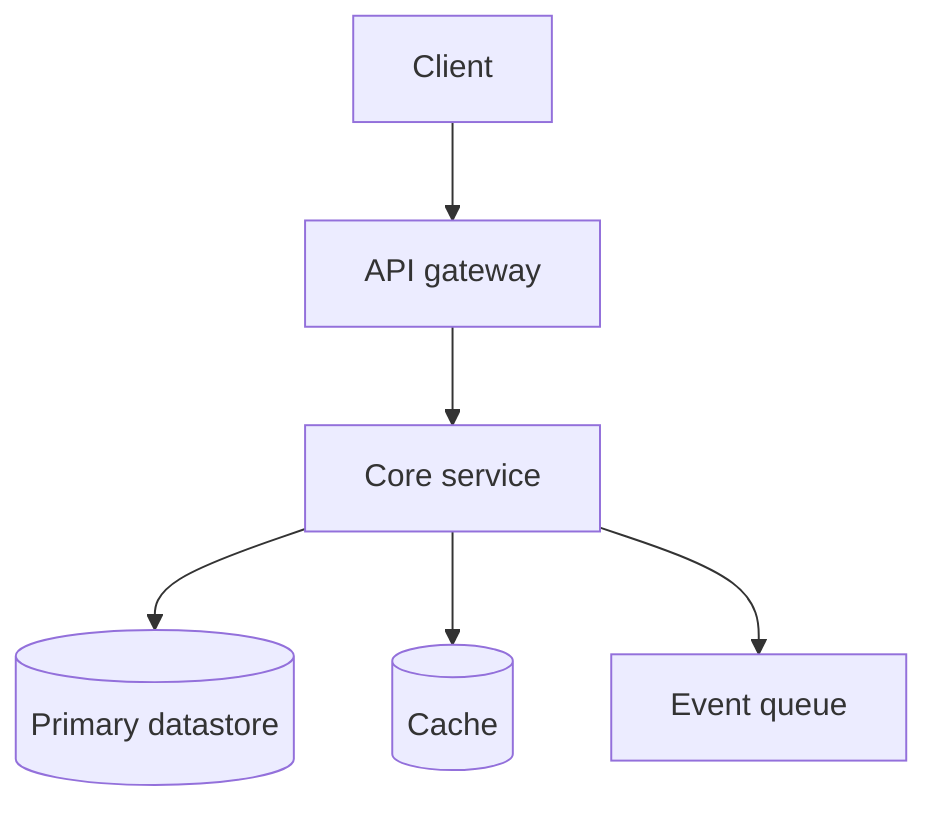

Open by stating what makes this system interesting to design — the constraint that dominates the
decisions. For a payment system it is correctness under partial failure; for a feed it is fan-out cost.
Naming it up front gives every later decision something to be measured against.

## Requirements

<Requirements
  functional={['What users can do.', 'One capability per line.']}
  nonFunctional={[
    'Latency, availability, consistency and durability targets.',
    'Be specific: p99 under 200ms, not "fast".',
  ]}
  outOfScope={['What is deliberately excluded, so the scope is honest.']}
/>

## Capacity estimate

<CapacityEstimate
  estimates={[
    { label: 'Daily active users', value: '10M', working: 'Given' },
    { label: 'Writes per second', value: '~230/s', working: '20M writes / 86,400' },
    { label: 'Peak writes per second', value: '~2,300/s', working: '10x average' },
    { label: 'Storage per year', value: '~2 TB', working: '20M/day x 300 bytes x 365' },
  ]}
>
  State what these numbers imply for the design. This is the section that prevents over-engineering:
  if the arithmetic says one database will do, say so, and spend the complexity budget elsewhere.
</CapacityEstimate>

## Architecture



Explain the service boundaries and _why they fall where they do_. A boundary with no justification is a
boundary that will be wrong.

## Data model

Schema for the core entities, with the access patterns that justify each index.

```sql title="schema.sql"
CREATE TABLE example (
  id bigserial PRIMARY KEY
);
```

## API design

The main endpoints, their shapes, and the idempotency and pagination decisions.

## Key mechanisms

A section per hard part — the pieces that make this system specifically difficult. This is the substance
of the case study, and it is where diagrams and state machines belong.

## Failure scenarios

<FailureScenarios
  scenarios={[
    {
      failure: 'Component fails mid-operation',
      impact: 'What state the system is left in',
      mitigation: 'How the design detects and recovers',
    },
  ]}
/>

## Security considerations

<SecurityNote>The threat that matters most for this system.</SecurityNote>

## Trade-offs made

<TradeOffs
  strengths={['What this design gets right.']}
  weaknesses={['What it gives up to get there.']}
>
  Tie the trade-offs back to the requirements and the capacity estimate.
</TradeOffs>

## What would change at ten times the scale

The next bottleneck and the order in which you would address it. This is what distinguishes a design
from a diagram.

<KeyTakeaways points={['The transferable lessons from this design.']} />
