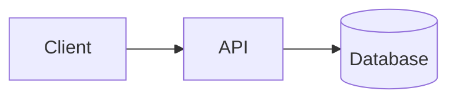

Open with a direct answer to the question in the title — two or three sentences that would satisfy
someone who reads nothing else. Do not open with "In today's fast-paced world".

Every section heading below is optional. Use the ones that serve this particular topic and delete the
rest; an article padded to fill a template is worse than a short one that answers the question.

## The problem it solves

What went wrong before this existed. Be concrete — a scenario, a number, a specific failure. This is
the most important section in the article, because a technique only makes sense against the problem it
addresses.

## Why it matters

The consequences of understanding or not understanding this. Keep it short.

## Core concepts

The vocabulary and mental model a reader needs. Prefer explaining one idea properly over listing five.

### A sub-concept

Use `###` for sub-concepts so they appear in the table of contents.

## How it works

The mechanism, step by step. Reach for a diagram when structure or sequence matters:



Apply the semantic node classes — `service`, `datastore`, `queue`, `cache`, `external`, `highlight` —
rather than writing colours. See CONTRIBUTING.md.

<Steps>
  <Step title="First step">What happens, and why it happens here rather than elsewhere.</Step>
  <Step title="Second step">Continue for as many steps as the flow genuinely has.</Step>
</Steps>

## Implementation example

Code that clarifies the concept, not a tutorial. Comment the decisions, not the syntax.

```typescript title="example.ts"
export function example(): void {
  // Explain why this approach, not what this line does.
}
```

## Trade-offs

<TradeOffs
  strengths={['A concrete benefit.', 'Another concrete benefit.']}
  weaknesses={['A real cost.', 'Another real cost.']}
>
  Optional prose on when the trade is worth making. An article with no weaknesses listed has not
  finished thinking.
</TradeOffs>

## Failure scenarios

<FailureScenarios
  scenarios={[
    {
      failure: 'What goes wrong',
      impact: 'What the user or system experiences',
      mitigation: 'What the design does about it',
    },
  ]}
/>

## Security considerations

<SecurityNote>The security property most relevant to this topic.</SecurityNote>

Specific, actionable points. Omit this section entirely if the topic has no meaningful security
dimension — do not invent one.

## Scalability considerations

<ScalabilityNote>What changes about this under load.</ScalabilityNote>

## When to use it

The conditions that favour this approach, and the conditions that do not. "It depends" is not an
answer; "it depends on these three things, and here is how to tell" is.

<KeyTakeaways
  points={[
    'The points a reader should leave with.',
    'One line each, specific rather than generic.',
  ]}
/>
